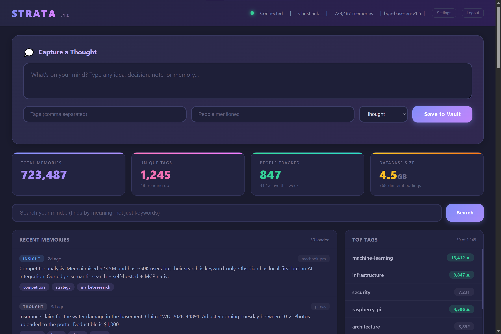

# SOLUM

**Light enough to run on a Raspberry Pi, useful enough for your whole agent stack.**

Solum is a self hosted AI memory server. It gives any MCP compatible AI a persistent, searchable memory that lives on hardware you own. Your thoughts, your machine, your data. (Formerly Strata.)



## The problem

Your AI forgets everything the moment a session ends. Every new chat starts from zero. Solum fixes that: it gives Claude Code, Codex, or any MCP client a long term memory that persists across sessions and agents, so context survives the person, the project, and the gap between conversations.

## Runs on your own hardware

Solum runs on whatever you already have: a desktop, a mini PC, a NAS, a homelab box, a VPS, or a Raspberry Pi. The point is that it runs on YOUR machine, not in someone else's cloud.

The fact that it runs comfortably on a Raspberry Pi is the proof, not the identity: it does not need expensive infrastructure. Semantic search, embeddings, the dashboard, the file vault, all of it fits on a small board drawing a few watts. The same install scales up to a real server when you want it to.

## What it does

- **Search by meaning.** Ask for "money stuff" and it finds your notes about budgets and investments. Not keyword matching, actual semantic understanding via vector embeddings.
- **Hybrid search.** Blends keyword matching and meaning when exact terminology matters.
- **Per agent memory with permissions.** Every AI agent gets its own key with granular read, write, delete, and admin rights. Disable a key and that agent is cut off instantly.
- **Branches and stars.** Related thoughts cluster as branches under a parent star, so a project and its notes read as one cluster instead of scattered entries. Star 0 at the center is you, the owner, the point every memory orbits.
- **File vault.** Attach real files to a thought: code, documents, whole project archives. The thought is the index, the vault holds the goods.
- **Audit trail.** Every create, update, and delete is logged, so you can see who or what touched a memory and when.
- **Dedup protection.** Try to save something close to what you already saved and Solum warns you instead of piling on duplicates.
- **Owner controlled deletion.** An AI can read and write, but it cannot delete a memory unless you hand it the admin key. Your data, your control.

## How the memory works

A normal database searches by keywords. Store "switching careers" and search for "new job" and you get nothing.

Solum converts every thought into a 768 dimension vector that captures what it means, so "switching careers", "new job", and "career change" all find each other. Vectors live in PostgreSQL via pgvector with an HNSW index for fast similarity search, alongside tsvector full text search and JSONB tags. The embedding model (BAAI/bge-base-en-v1.5) runs locally through ONNX Runtime, uses roughly 100 to 150 MB of RAM, and unloads after a few minutes idle.

## Try it with sample data

Prefer to start from something real instead of an empty database? Download the sample dataset and land in a dashboard, search, and 3D constellation already full of example thoughts.

**[ Download the demo dataset ](https://github.com/agenerationforwordz-tech/solum/releases/latest/download/solum_demo_seed.sql)**

Once your database is created (see Getting started below), load it with one command:

```bash
psql -U solum -d solum_db -f solum_demo_seed.sql
```

Everything in it is sample data, so capture, edit, and delete freely. When you are ready for your own, just start with an empty database instead.

## Getting started

Solum uses PostgreSQL with the pgvector extension.

**1. Prerequisites:** Python 3.10 or newer, and PostgreSQL with pgvector installed.

**2. Clone and install:**
```bash
git clone https://github.com/agenerationforwordz-tech/solum.git
cd solum
python -m venv venv
source venv/bin/activate        # Windows: venv\Scripts\activate
pip install -r requirements.txt
```

**3. Create the database and load the schema:**
```bash
# create a role and database (adjust the password)
sudo -u postgres psql -c "CREATE USER solum WITH PASSWORD 'choose-a-db-password';"
sudo -u postgres psql -c "CREATE DATABASE solum_db OWNER solum;"
sudo -u postgres psql -d solum_db -c "CREATE EXTENSION IF NOT EXISTS vector;"
PGPASSWORD='choose-a-db-password' psql -h localhost -U solum -d solum_db -f solum_pg_schema.sql
```

**4. Point Solum at it and run:**
```bash
export SOLUM_DB_BACKEND=postgresql
export SOLUM_PG_HOST=localhost
export SOLUM_PG_DB=solum_db
export SOLUM_PG_USER=solum
export SOLUM_PG_PASSWORD='choose-a-db-password'
python server.py
```

The server runs at `http://0.0.0.0:4320`. Open it in a browser and the dashboard walks you through first run setup. The embedding model downloads once (about 170 MB) and is cached after that.

## First run setup

Open `http://your-server:4320` and you will be guided through four steps:

1. **Password.** Creates your owner account (PBKDF2-SHA256, hashed, never stored in plaintext).
2. **Recovery phrase.** A 12 word phrase, shown once. Write it down. It is the only way to reset a forgotten password, and it is stored only as a hash.
3. **Admin key.** Choose your own or generate one, shown once. This is the credential you hand to an AI for deletes, and the key for command line or automation. Your normal dashboard login already grants admin in the browser, so you only need this key for non browser access.
4. **Star 0.** Tell Solum who this instance is for and what you use it for. This is the center of your constellation, and it is also readable by your agents so they know whose memory they are working in.

## Connecting an AI

Every MCP tool requires an enabled agent key, so first create one from the dashboard at `/admin/agents` (set its read, write, and delete permissions). Then point your client at the MCP endpoint and send the key.

### Claude Code
```bash
claude mcp add --transport http solum http://your-server:4320/mcp \
  --header "X-API-Key: your-agent-key"
```

### Any HTTP client
```bash
# Save a thought
curl -X POST http://your-server:4320/api/capture \
  -H "Content-Type: application/json" \
  -H "X-API-Key: your-agent-key" \
  -d '{"content": "Solum is running on my own hardware", "tags": ["setup"]}'

# Search by meaning
curl -X POST http://your-server:4320/api/search \
  -H "Content-Type: application/json" \
  -H "X-API-Key: your-agent-key" \
  -d '{"query": "server setup", "limit": 5}'

# Health check (no auth)
curl http://your-server:4320/health
```

## Configuration

Set via environment variables (see `config.py` for the full list):

| Variable | Default | What it does |
|----------|---------|--------------|
| `SOLUM_DB_BACKEND` | `sqlite` | Set to `postgresql` to use Postgres + pgvector |
| `SOLUM_PG_HOST` | `localhost` | PostgreSQL host |
| `SOLUM_PG_DB` | `solum_db` | Database name |
| `SOLUM_PG_USER` | `solum` | Database user |
| `SOLUM_PG_PASSWORD` | *(empty)* | Database password (env only, never hardcode it) |
| `SOLUM_PORT` | `4320` | Server port |
| `SOLUM_HOST` | `0.0.0.0` | Listen address |
| `SOLUM_DATA_DIR` | `./data` | Data and vault location |
| `SOLUM_ADMIN_KEY` | *(empty)* | Optional deploy time admin key (you can also set one at setup) |

## The MCP tools

Every tool below requires an enabled agent key, so a key you disable loses both read and write access immediately.

| Tool | What it does |
|------|--------------|
| `capture_thought` | Save a memory, with auto tagging, dedup check, and optional branch parent |
| `semantic_search` | Find memories by meaning |
| `hybrid_search` | Keyword and meaning blended |
| `get_relevant_context` | Smart bundle: deduped and grouped by type |
| `find_related` | More like this, for a given thought |
| `search_by_tag` / `search_by_person` | Filter by tag or person |
| `search_advanced` | Stack filters: type, tag, source, machine, date |
| `temporal_search` | Find what happened in a time window |
| `list_recent` | What got captured lately |
| `get_thought` / `get_children` | Read one thought, or the branches under a star |
| `update_thought` | Edit a thought (re embeds automatically) |
| `delete_thought` | Remove a thought (admin key required) |
| `set_parent` | Link a thought as a branch under a parent star |
| `get_stats` / `generate_report` | Database stats, and trend reports |
| `startup_bundle` | One call boot context for an agent |
| `get_history` | The audit trail of changes |

## Web dashboard

Solum ships a full dashboard at `/dashboard` and a 3D constellation view at `/constellation`.

- **Capture and edit** thoughts with tags, people, and any of the ten thought types.
- **Semantic and tag search** straight from the browser.
- **Constellation:** every memory is a star, colored by type, clustered by meaning, with Star 0 (you) at the center.
- **Agent manager** at `/admin/agents`: create agent keys, set permissions, and flip the kill switch. Your dashboard login opens it, no separate key needed.
- **Account security:** password change, 12 word recovery, per device sessions, and a login history.

## Security

- **Per agent keys** with granular read, write, delete, and admin permissions. Every MCP tool and REST endpoint checks them.
- **Dashboard auth** is separate: PBKDF2-SHA256 password hashing (480K iterations, random salt, constant time compare), 256 bit session tokens, and a hashed 12 word recovery phrase.
- **Owner only deletion.** AI clients cannot delete without the admin key.
- **Per agent kill switch.** Disable any agent key and its read and write access stop at once.
- **Global emergency kill switch.** One toggle cuts off EVERY agent across the whole instance at once: all `/mcp` and `/api/*` requests return 503 and no agent can touch memory. Your login and the admin panel stay reachable so you can re-enable it, agent keys cannot undo it, and the state survives restarts. Flip it from the agent manager at `/admin/agents`.
- **Input limits and hardening:** size limits per thought and per file, prompt injection markers for AI content, output escaping, atomic file writes, and path traversal protection on the vault.
- **Rate limiting** on the public REST API: 30 requests per minute per IP.

## How it is built

```
AI clients (Claude Code, Codex, bots)        Humans (browser)
        |                  |                       |
   MCP (/mcp)         REST (/api/*)        Dashboard + constellation
        |                  |                       |
        +----- server.py: auth, rate limiting, sanitization -----+
        |                  |                       |
   agent keys         agent keys             password + session
        |                  |                       |
   embedder.py        vault.py              auth.py (PBKDF2, seeds)
   ONNX model        file storage                  |
        |                  |                       |
        +------ db.py: PostgreSQL + pgvector + tsvector ---------+
              thoughts, embeddings, vault, users, sessions
```

## License

PolyForm Noncommercial License 1.0.0. Copyright (c) 2026 A Generation Forwordz Foundation.

Source available. Use it, run it, study it, improve it, share it. Keep it noncommercial and keep the attribution. See [LICENSE](LICENSE) for the full terms.

---

Built by Christian Mitchell. If you run it, keep the attribution.
